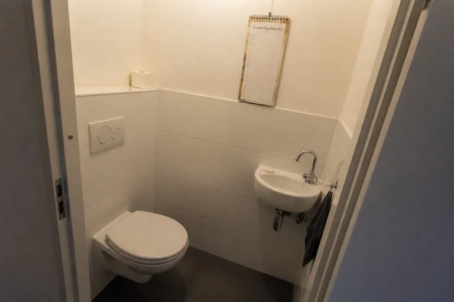
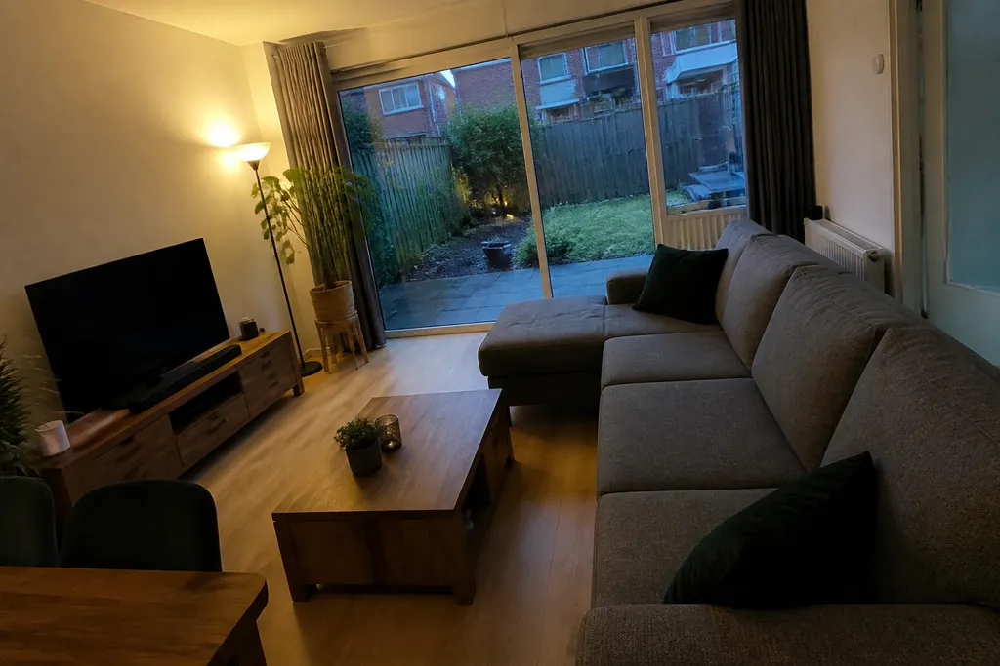
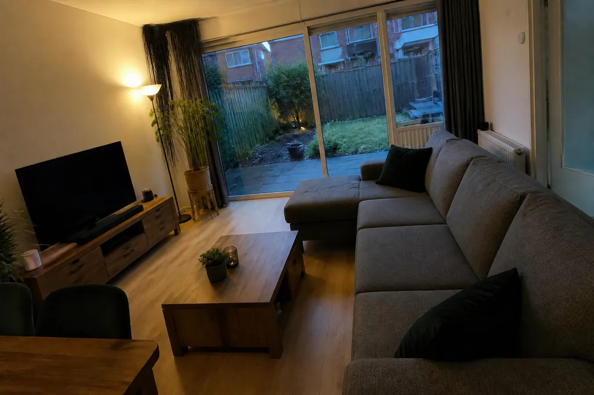
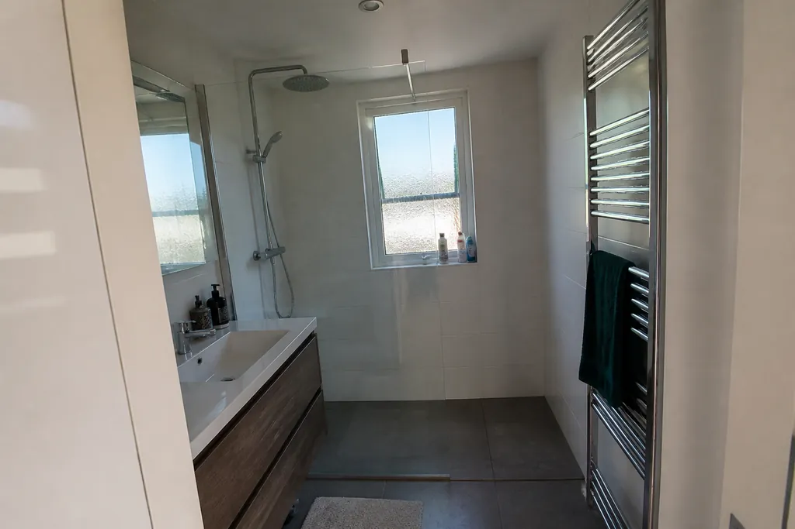
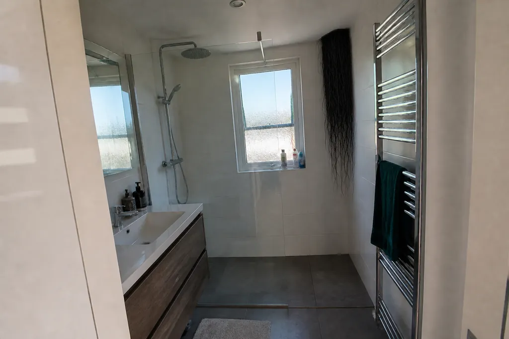
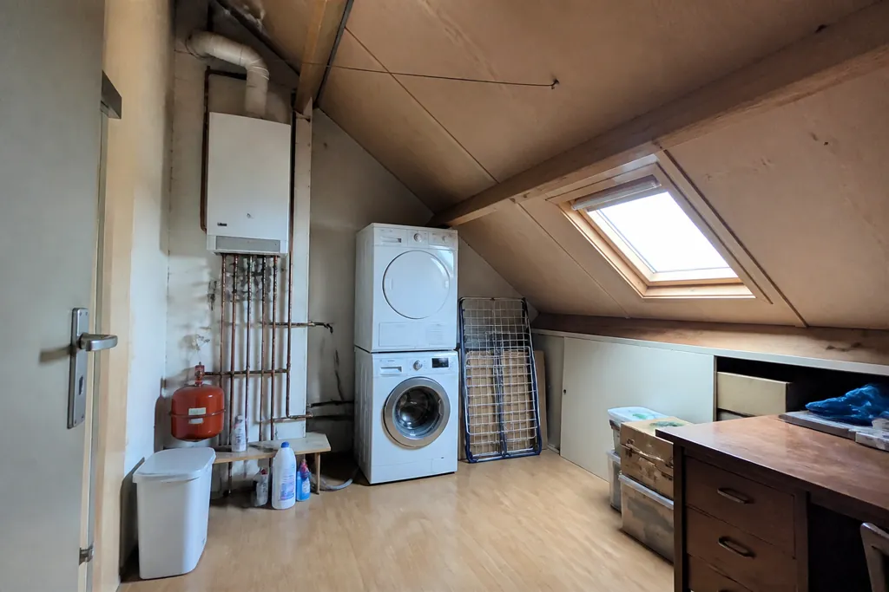
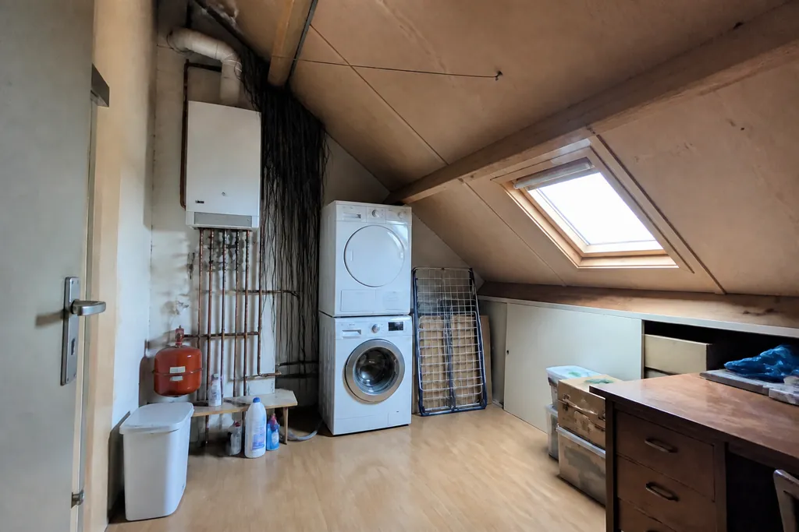
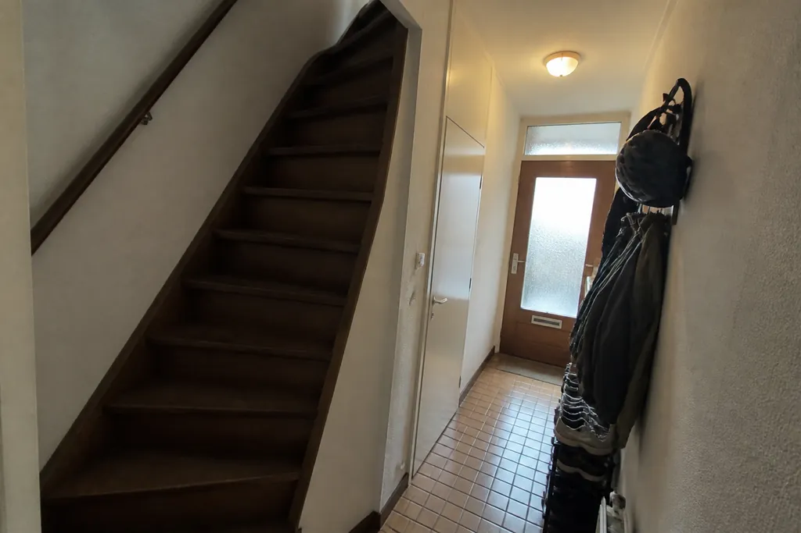
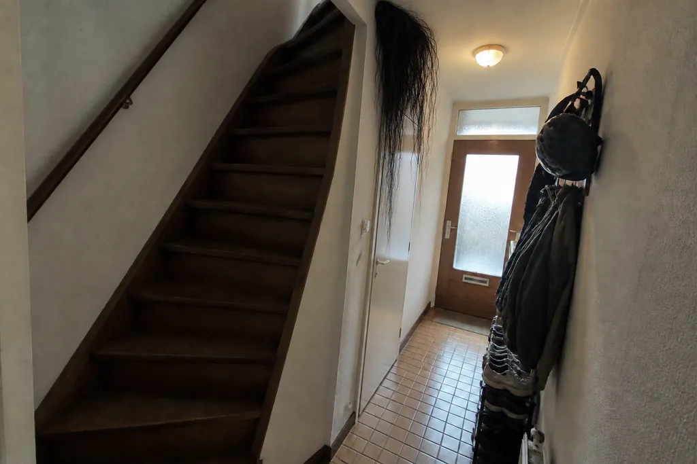

# Lumen for Home Assistant

A calm, modern look for Home Assistant: a **theme** with frosted-glass cards, plus a
**dashboard generator** that builds a floor → room dashboard from a short YAML file.
It includes photo room cards, a floating navigation bar with a sliding indicator, and a
mini header with search and Assist.

[](https://hacs.xyz)
[](https://github.com/vicvancooten/lumen-ha/actions/workflows/validate.yml)

<p align="center">
  
</p>

<p align="center">
  
  
  
</p>

<details>
<summary>More screenshots</summary>


</details>

## What's in the box

| Part | What it does |
| --- | --- |
| `themes/lumen.yaml` | The **Lumen** theme. Light and dark modes, Inter typography, soft 28px frosted cards with pill-shaped chips, buttons, sliders and icons, violet accent, warm amber for lights that are on. With card-mod, cards rise in when a page opens and lift on hover. Status bar colours match the page for an edge-to-edge app look. |
| `dashboard/build_dashboard.py` | Generates the dashboard: a home page (greeting, weather, quick settings, energy, every room as a photo card), one page per floor, and one page per room with lighting, media, vacuum, fridge, climate, power and details sections. |
| `dashboard/house.example.yaml` | Describes your home: floors, rooms and which entities go where. |

## 1. Install the theme

### Through HACS (recommended)

1. Open **HACS**, click the ⋮ menu (top right), then **Custom repositories**.
2. Add `https://github.com/vicvancooten/lumen-ha` with the type **Theme**.
3. Search for **Lumen** in HACS and click **Download**.
4. Go to **Developer tools → YAML** and click **Reload themes**, or restart Home Assistant.
5. Open your **profile**, set **Theme** to **Lumen** and the mode to **Auto**.

HACS themes need themes enabled in `configuration.yaml`. Most setups already have this:

```yaml
frontend:
  themes: !include_dir_merge_named themes
```

### Manually

Copy `themes/lumen.yaml` to `/config/themes/lumen.yaml`, then follow steps 4–5 above.

> **Frosted blur:** install [card-mod](https://github.com/thomasloven/lovelace-card-mod) (HACS → Frontend)
> to get the blur behind cards. Without card-mod the theme still works; cards are just solid.

## 2. Generate the dashboard (optional)

The theme stands on its own. The generator adds the full dashboard.

### Requirements

Install these frontend cards from **HACS → Frontend**:

- [Mushroom](https://github.com/piitaya/lovelace-mushroom)
- [mini-graph-card](https://github.com/kalkih/mini-graph-card)
- [Room Summary Card](https://github.com/homeassistant-extras/room-summary-card)
- [card-mod](https://github.com/thomasloven/lovelace-card-mod)
- [Navbar Card](https://github.com/joseluis9595/lovelace-navbar-card)
- [Kiosk Mode](https://github.com/NemesisRE/kiosk-mode) (hides the default header and sidebar)

You also need Python 3.10+ on any machine that can reach Home Assistant.

### Steps

1. **Create a long-lived access token.** Go to your profile → **Security**, scroll to
   **Long-lived access tokens**, create one and save it to a file, e.g. `~/.config/lumen/ha-token`.
   You can also export it as `HA_TOKEN`.
2. **Set up floors and areas** in **Settings → Areas, labels & zones**. Add a picture to each area:
   it becomes the room photo.
3. **Optional: create an "All lights" group** for the quick-settings tile:
   **Settings → Devices & services → Helpers → Create helper → Group → Light group**.
4. **Describe your home:**

   ```bash
   git clone https://github.com/vicvancooten/lumen-ha.git
   cd lumen-ha/dashboard
   pip install -r requirements.txt
   cp house.example.yaml house.yaml   # house.yaml is git-ignored
   ```

   Edit `house.yaml`. Room keys are your HA **area IDs**, floor `id`s are your HA **floor IDs**,
   and every entity list takes plain IDs or `{entity, name, icon, color}` objects.
   Everything except `floors` and `rooms` is optional. The example file documents each section.

5. **Generate:**

   ```bash
   python3 build_dashboard.py house.yaml --dry-run   # writes home-dashboard.json, touches nothing
   python3 build_dashboard.py house.yaml             # creates/updates the dashboard in HA
   ```

   The generator creates the dashboard if it doesn't exist yet and adds the Inter font as a dashboard
   resource. Re-run it whenever you add devices or rooms.

### Using the dashboard

- **Bottom bar:** Home, one tab per floor, and **More** (Edit dashboard, Energy, History, Map,
  Settings, Profile & theme, Show sidebar). A floor's tab stays highlighted inside its rooms.
- **Top bar:** page name, back (on room pages), search, Assist and notifications.
- **Room pages:** the room's photo is the page background, fading into the page colour as you scroll, with the room name large on top.
- **Room cards:** tap to open the room, and tap a device icon to toggle it. The card lights up when a light
  is on and gets a green border while there's motion.
- **Get the normal HA interface back:** use **More → Show sidebar**, or add `?disable_km` to any dashboard URL.
  To keep HA's own header and sidebar permanently, set `dashboard.kiosk: false`.

### Haunted rooms (optional)

Add a `haunted:` section to `house.yaml` (see the commented example) and every so often, for about a
second, long black hair creeps out of a corner of a room photo, Grudge-style. Blink and it's gone.

<p align="center">
  
</p>

<details>
<summary>More haunted rooms</summary>

| Room photo | Haunted |
| --- | --- |
|  |  |
|  |  |
|  |  |
|  |  |

</details>

The generator sends each room's area picture to an image model (OpenAI `gpt-image-2` by default, so you
need an API key) with a prompt to add the hair, and uploads the result to Home Assistant's image store.
Rooms without a picture get an imagined one. Images are cached in `haunted-cache.json` and only
regenerated when the room photo, prompt or model changes; `--rehaunt` forces new ones. `--dry-run` never
generates images, it only uses what's already cached. Each room shows up on its own random timer,
averaging once every `every` seconds.

## Troubleshooting

- **Cards show "Custom element doesn't exist":** one of the required HACS cards is missing. Install it, then hard-refresh the browser.
- **Rooms missing:** the room key must match an HA area ID, and its `floor` must match a floor `id` in `floors`.
- **`WARNING: entities not found`:** the generator lists entity IDs from `house.yaml` that don't exist in HA.
- **Theme not in the list:** reload themes (Developer tools → YAML) and check the `frontend: themes:` include above.
- **Navbar overlaps the phone's gesture bar:** update navbar-card, and make sure the companion app runs edge-to-edge.

## License

MIT, see [LICENSE](LICENSE).
